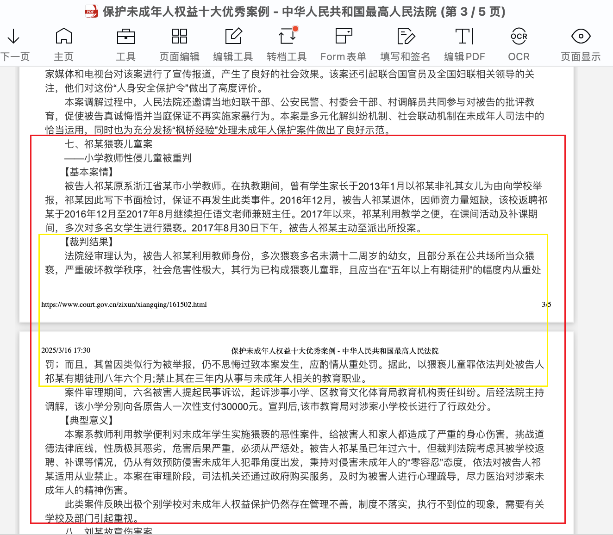

# 大模型与法律 LLM + RAG

<!-- PROJECT SHIELDS -->

[![Contributors][contributors-shield]][contributors-url]
[![Forks][forks-shield]][forks-url]
[![Stargazers][stars-shield]][stars-url]
[![Issues][issues-shield]][issues-url]

## 简介

本项目是一个基于大模型的法律问答系统，LangChain 作为开发框架， DeepSeek 作为 LLM 大模型，智谱的 Embedding-3 作为 Embedding 模型。

该项目旨在展现 LangChain 和 RAG（Retrieval Augmented Generation） 的使用，可作为大模型应用的 HelloWorld 示例应用。

---

项目依赖：

- LangChain：构建大模型应用框架
- DeepSeek：深度求索大模型
- 智谱 AI：词嵌入 Embedding 模型
- Chroma：向量数据库


## TODO
- [x] 基于 LangChain 实现 LLM+RAG+法律对话系统
- [ ] 数据处理：格式化，删除空格、分隔符等
- [ ] 增量更新：支持增量更新知识库
- [ ] 开发交互式应用，如 Web 或 App
- [ ] 校验RAG效果

## 效果演示

问题：赵某为某市小学教师。在执教期间，曾有学生家长于2019年1月以赵某非礼其女儿为由向学校举报，赵某因此写下书面检讨，保证不再发生此类事件。然而，2019年1月至2022年6月以来，赵某利用教学之便，在课间活动及补课期间，多次对5名女学生进行猥亵。你作为法官审理该案件，该如何审判？

---

LLM 回答：

作为法官，审理此类案件时，必须严格遵守法律程序，确保公正、公平地处理案件，同时保护受害者的权益。以下是审理此类案件时可能采取的步骤和考虑因素：

1. **案件事实的审查**
   - **证据收集**：首先，需要审查所有相关证据，包括受害者的陈述、目击证人的证言、学校的记录、赵某的书面检讨等。确保所有证据的真实性和合法性。
   - **受害者的陈述**：听取受害者的陈述，了解她们的经历和感受。确保她们在陈述过程中得到充分的尊重和保护，避免二次伤害。
   - **赵某的供述**：听取赵某的供述，了解他对指控的回应和辩解。确保他在法律程序中的权利得到保障。

2. **法律适用**
   - **刑法相关规定**：根据《中华人民共和国刑法》第二百三十七条，猥亵儿童罪是指以暴力、胁迫或其他方法猥亵儿童的行为。赵某的行为涉嫌构成猥亵儿童罪。
   - **量刑标准**：根据刑法规定，猥亵儿童罪的量刑标准较为严厉，通常处五年以下有期徒刑或者拘役。如果情节特别恶劣，可能处五年以上有期徒刑。

3. **情节认定**
   - **多次作案**：赵某在2019年1月至2022年6月期间多次对5名女学生进行猥亵，属于多次作案，情节恶劣。
   - **利用职务之便**：赵某作为教师，利用教学之便对未成年人实施猥亵，属于利用职务之便实施犯罪，应当从重处罚。
   - **受害者年龄**：受害者均为未成年人，尤其是小学生，属于特别需要保护的群体，赵某的行为对她们的身心健康造成了严重伤害。

4. **判决**
   - **罪名成立**：根据证据和法律规定，认定赵某犯有猥亵儿童罪。
   - **量刑**：鉴于赵某多次作案、利用职务之便、受害者均为未成年人等情节，应当从重处罚。根据刑法相关规定，判处赵某五年以上有期徒刑。
   - **附加处罚**：根据《中华人民共和国刑法》第三十七条，可以附加剥夺赵某从事教育工作的资格，禁止其在一定期限内从事与未成年人相关的职业。

5. **受害者保护**
   - **心理辅导**：为受害者提供必要的心理辅导和支持，帮助她们走出阴影，恢复正常生活。
   - **隐私保护**：在案件审理过程中，严格保护受害者的隐私，避免她们的姓名、身份等信息被公开。

6. **社会影响**
   - **警示教育**：通过此案的审理和判决，向社会传递严厉打击侵害未成年人权益行为的信号，警示其他潜在犯罪分子。
   - **学校责任**：建议学校加强师德师风建设，完善监督机制，防止类似事件再次发生。

7. **法律程序**
   - **上诉权**：赵某有权在法定期限内对判决提出上诉，法院将依法处理其上诉请求。

总结：作为法官，应当依法公正审理此案，确保赵某受到应有的法律制裁，同时保护受害者的权益，维护社会的公平正义。通过此案的审理，向社会传递出对侵害未成年人权益行为的零容忍态度，推动社会对未成年人保护的进一步重视。

---
LLM with RAG ：

根据提供的法律库信息，结合案件事实，赵某的行为已构成**猥亵儿童罪**。以下是审判分析及判决建议：

**案件事实分析**
1. **主体身份**：赵某为小学教师，具有特殊的教育职责和监护义务，其行为不仅违反职业道德，还严重侵害未成年人权益。
2. **行为性质**：赵某利用教学便利，多次对5名女学生实施猥亵，且部分行为发生在公共场所（如课间活动及补课期间），情节恶劣。
3. **主观恶性**：赵某曾因类似行为被举报，并写下书面检讨，但其不思悔改，继续实施犯罪行为，主观恶性较大。
4. **社会危害性**：赵某的行为严重破坏教学秩序，对被害学生及其家庭造成严重的身心伤害，社会危害性极大。

**法律适用**
根据《中华人民共和国刑法》第二百三十七条关于**猥亵儿童罪**的规定：
- 以暴力、胁迫或其他方法猥亵儿童的，处五年以下有期徒刑或者拘役。
- 聚众或者在公共场所当众猥亵儿童的，处五年以上有期徒刑。

赵某的行为符合以下加重情节：
1. **多次实施猥亵**：赵某在2019年1月至2022年6月期间多次对5名女学生实施猥亵。
2. **利用教师身份**：赵某利用教学便利实施犯罪，属于利用特殊身份侵害未成年人权益。
3. **公共场所当众实施**：部分行为发生在课间活动及补课期间，属于公共场所当众实施猥亵。
4. **曾因类似行为被举报**：赵某曾因非礼学生被举报并写下书面检讨，但仍继续实施犯罪行为，主观恶性较大。


**判决建议**
1. **罪名认定**：赵某的行为构成**猥亵儿童罪**，且情节严重，符合加重处罚的情形。
2. **量刑建议**：
   - 根据法律规定及类似案例（如祁某案），赵某的行为应判处**五年以上有期徒刑**。
   - 鉴于赵某曾因类似行为被举报仍不思悔改，主观恶性较大，建议从重处罚。
3. **附加处罚**：
   - 禁止赵某从事与未成年人相关的职业（如教师、培训师等）。
   - 对被害学生及其家庭进行心理疏导及必要的经济赔偿。

**判决结果**
综上所述，判决如下：
1. 赵某犯**猥亵儿童罪**，判处**有期徒刑七年**。
2. 禁止赵某从事与未成年人相关的职业，期限为**终身**。
3. 责令赵某赔偿被害学生及其家庭的经济损失，并承担相应的心理治疗费用。


**判决依据**
1. 《中华人民共和国刑法》第二百三十七条。
2. 最高人民法院关于保护未成年人权益的相关司法解释及典型案例。

以上判决旨在严惩犯罪行为，保护未成年人合法权益，维护社会公平正义。

---

该问题由祁某案改编而成。

评价：LLM + RAG 审判结果与祁某的案例审判结果基本一致，并且引用了该案件。👍👍👍




## 项目结构
```
.
├── README.md   # 项目说明文档
├── chroma      # 向量存储目录
├── law_data    # 知识库目录
├── main.py     # 主程序
├── requirements.txt # 依赖
├── vector.py   # 基于 Chroma 的向量类
└── zhipuai_embedding.py # 智谱 AI 的 Embedding 类
```

## 前置准备

克隆项目
```shell
git clone https://github.com/xiaolinstar/llm-law.git
# git clone git@github.com:xiaolinstar/llm-law.git
```

进入目录
```shell
cd llm-law
```

安装依赖

```shell
# 1. 创建 conda 环境
conda create -n llm-law python=3.10
# 2. 激活 conda 环境
conda activate llm-law
# 3. 安装项目依赖
pip install -r requirements.txt -i https://pypi.tuna.tsinghua.edu.cn/simple
```

DeepSeek 和 智谱 AI 的 API 密钥需要在环境变量中配置。

一次性的：
```shell
export OPENAI_API_KEY="deepseek-api-xxx"
export ZHIPUAI_API_KEY="zhipu-api-xxx"
```

永久有效的：
```shell
echo "export OPENAI_API_KEY=\"deepseek-api-xxx\"" >> ~/.bashrc
echo "export ZHIPUAI_API_KEY=\"zhipu-api-xxx\"" >> ~/.bashrc
```

`.bashrc` 根据你的 shell 情况可以是 `.zshrc`或其他。

## 快速开始

运行主程序

```shell
python main.py
```

修改问题：`main.py` 中的 `questions` 变量，代码第 50 行

```
questions = ["赵某为某市小学教师。在执教期间，曾有学生家长于2019年1月以赵某非礼其女儿为由向学校举报，赵某因此写下书面检讨，保证不再发生此类事件。然而，2019年1月至2022年6月以来，赵某利用教学之便，在课间活动及补课期间，多次对5名女学生进行猥亵。你作为法官审理该案件，该如何审判？"]
```

## 自定义知识库
RAG 基于向量检索，需要有知识库。

知识库的目录为 `./law_data`，本项目代码中支持 PDF 和 Markdown 格式。

重要参数可在 `main.py` 中修改：

```
# 重要参数，可自行修改
# DeepSeek LLM
TEMPERATURE = 0.7
MAX_TOKENS = 1024

# Vectordb
DATA_DIR = "./law_data"
PERSIST_DIR = "./chroma"
CHUNK_SIZE = 20
OVERLAP = 5
```

如果您在体验之后，进一步尝试：

1. 修改参数（CHUNK_SIZE 或 OVERLAP）
2. 更新知识库

进行以下操作即可：

1. 修改 `main.py` 中的参数
2. 更新 `./law_data` 目录下的文件
3. 删除 `./chroma` 目录下的所有文件

然后重新运行 `main.py` 即可。

## Reference

[1]. LangChain https://github.com/langchain-ai/langchain

[2]. 动手学习大模型 https://datawhalechina.github.io/llm-universe/#/ 

[3]. LangChain 自定义 智谱 AI Embedding类 https://github.com/datawhalechina/llm-universe/blob/main/notebook/C3%20%E6%90%AD%E5%BB%BA%E7%9F%A5%E8%AF%86%E5%BA%93/zhipuai_embedding.py

[4]. DeepSeek API 文档 https://api-docs.deepseek.com/zh-cn/

[5]. 智谱大模型API Keys https://bigmodel.cn/usercenter/proj-mgmt/apikeys

[6]. 面向法律场景的大模型 RAG 检索增强解决方案 https://developer.aliyun.com/article/1649317?spm=5176.2020520130.0.0.67bd697b9cRzjc&msctype=pmsg&mscareaid=cn&mscsiteid=cn&mscmsgid=7630125021100903556&yunge_info=pmsg___7630125021100903556&tlog=yuekan_2501

[7]. Anaconda https://anaconda.org/anaconda/conda

[8]. 保护未成年人权益十大优秀案例 https://www.court.gov.cn/zixun/xiangqing/161502.html

## 联系作者

1. 在issues中提问
2. 联系邮箱 :email: xing.xiaolin@foxmail.com

<!-- links -->

[contributors-shield]: https://img.shields.io/github/contributors/xiaolinstar/llm-law.svg?style=flat-square
[contributors-url]: https://github.com/xiaolinstar/llm-law/graphs/contributors
[forks-shield]: https://img.shields.io/github/forks/xiaolinstar/llm-law.svg?style=flat-square
[forks-url]: https://github.com/xiaolinstar/llm-law/network/members
[stars-shield]: https://img.shields.io/github/stars/xiaolinstar/llm-law.svg?style=flat-square
[stars-url]: https://github.com/xiaolinstar/llm-law/stargazers
[issues-shield]: https://img.shields.io/github/issues/xiaolinstar/llm-law.svg?style=flat-square
[issues-url]: https://github.com/xiaolinstar/llm-law/issues